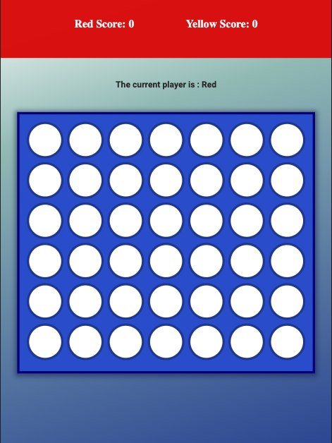

# JS-Game-Challenge-May/June-22

## Technology Consultancy 12 week programme at \_Nology.io.

### Week 4 project - Connect 4

Build a working game using vanilla Javascript, SCSS and BEM.

The game is functioning, but I would like to implement the following:

#### Next steps :

Design so user can click at the top of a column and token will drop down, as opposed to clicking on the chosen cell.

Add sounds.

Implement a 1 player (against computer) mode.

Improve responsiveness.

Improve UI.

